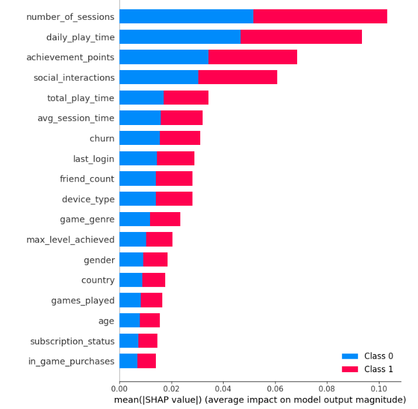

# main.py
1. First import necessary libraries which we want
2. Data Loading
3. Data preprocessing
   # a. Drop Unnecessary columns (UserID)
   # b. Check for null values if there any imputate
   # c. Encoding the categorical variables
4. EDA
   # a. Outlier Detection (Distortion between data distribution) if any remove/imputate if we consider certain attribute is important 
   # b. Count plot for churn dataset to check data is imbalanced or not
   # c. Heatmap to see correlation between variables (mainly with target variable)
5. Feature Engineering
   # a. Normalize the data except for categorical variables
6. Splitting the data
   # a. 4:1 ratio we divide the data inorder to train a model and validate it

# Extra operation:
    1. As from (4-b) we clearly know that the data is slightly imbalanced
    2. So I did oversampling using smote library for minority class for only training

7. Model Training
   # a. Random Forest 
   # b. LIGHTGBM
   # c. K-Nearesr Neighbor
   # d. Gaussian Naive Bayes
   # e. Stacked Classifier (Gaussian Naive Bayes+KNN)

8. Model Evaluation I used metrics Accuracy,precision,recall,f1-score
   # a. accuracy= no of correctly identified / total observations (LIGHTGBM)
   # b. Precision= TP/(TP+FP) (KNN)
   # c. recall=TP/TP+FN  as inorder to increase our users which the main important is not to loose old users. so in which we have to predict correctly such that minimizing fn is good (Naive Bayes)
   # d. f1-score (Naive Bayes only) 

9. Feature Importance I used SHAP model (Explainable AI)
   # a. By using SHAP,  you can gain insights into the feature importances and contributions of features to predictions from Naive Bayes models.

# src
  1. box_plotting1.py
      # I used this method for outlier detection using boxplot
  2. update_metrics.py
      # I wrote this function to update the metrics in a dataframe which helps us to compare easily

# Used Generative AI Tools
   1. Only One tool (ChatGPT)
       # i. With so many machine learning libraries available, it can be difficult to remember which one to use for specific tasks. Using reference materials or guides can simplify the process of selecting the right library for your needs.
       # ii. From 4-b I came to know that the data is imabalanced. To work efficiently with dataset I don't know what to do. So I approached GPT so GPT provided me how to do oversampling for minority class.

# Shap Model (Interpretable,Model-Agnostic)
1. SHAP provides a unified framework for interpreting predictions, making it possible to understand the contribution of each feature to the model’s predictions.
2. Model-Agnostic: SHAP can be applied to any machine learning model, from simple linear models to complex deep learning models.

